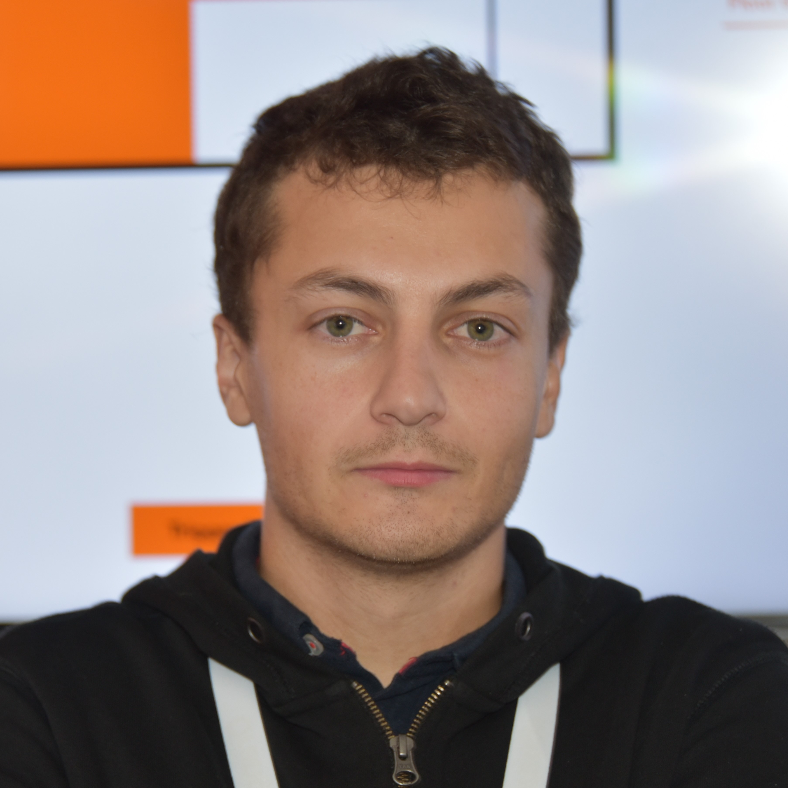

## AI Researcher at Orange

I am a researcher at Orange Innovation since 2015. My research mainly focuses on the **identification of human context information in pervasive systems**:

- **Recognizing human activities in smart homes** and other smart environments from heterogeneous ambient data.
- **Predicting future human activities in smart homes**, through the use of Dynamic Bayesian Networks (DBN).
- **Identifying human emotions** from physiological data, with **attention-based models**.

## Contact information

Mail: [julien1.cumin@orange.com](mailto:julien1.cumin@orange.com)

- [Google Scholar](https://scholar.google.com/citations?user=byW2uYQAAAAJ&hl=en)
- [DBLP](https://dblp.org/pid/174/6777.html)
- [Researchgate](https://www.researchgate.net/profile/Julien-Cumin)

> Julien Cumin, Orange 
> 22 chemin du Vieux Chêne 
> 38240 Meylan, France

